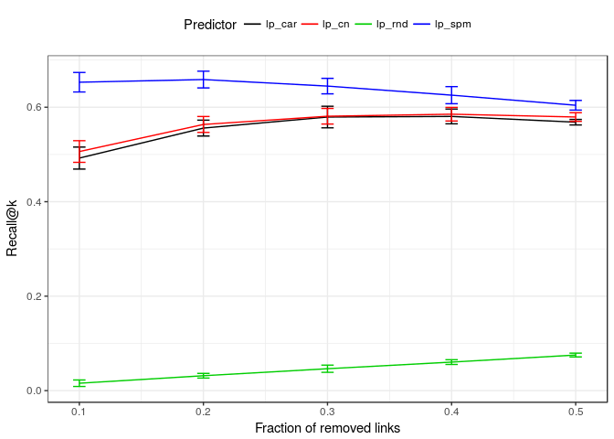

LinkPrediction
================
Gregorio Alanis-Lobato

Implementation of different classes of link predictors and methods to assess and visualise their performance.

Introduction
============

Complex systems can be represented by graphs *G*(*V*, *E*), where *E* is the set of interactions (edges) between a set *V* of system components (nodes). Link predictors assign likelihood scores of interaction to all node pairs that are disconnected in the observable network topology. These scores can lead to the prediction of future friendships in a social network or future direct flights between cities in an airport transportation network.

To assess the performance of link predictors, one normally removes an increasing number of edges *E*<sup>*R*</sup> ⊂ *E* from the network of interest, applies a link prediction method to the pruned network and evaluates its performance with one of the following metrics:

-   `recall_at_k`: Reports of the fraction of candidate links with the |*E*<sup>*R*</sup>| highest likelihood scores that are in *E*<sup>*R*</sup> (Recall at *k*, where *k* = |*E*<sup>*R*</sup>|).
-   `aupr`: The area under the Precision-Recall curve.
-   `auroc`: The area under the Receiving Operating Characteristic curve.
-   `avg_prec`: The average Precision at the point where Recall reaches its maximum value of 1.

`LinkPrediction` implements the following classes of link prediction techniques:

-   Neighbourhood-based predictors, which assign high likelihood scores to node pairs that share many neighbours (`lp_cn`, `lp_pa`, `lp_jc`, `lp_dice`, `lp_aa`, `lp_ra` and `lp_l3`).
-   CAR-based predictors, which assign high likelihood scores to node pairs that share many neighbours that also interact with themselves (`lp_car`, `lp_cpa`, `lp_caa` and `lp_cra`).
-   Embedding-based methods rank non-adjacent nodes through distances on a network projection in two-dimensional Euclidean space (`lp_isomap`, `lp_leig`, and `lp_mce`).
-   The Hierarchical Random Graph method, which searches the space of all possible dendrograms of a network for the ones that best fit its hierarchical structure. Non-adjacent node pairs that have high average probability of being connected within these dendrograms are considered good candidates for interaction (`lp_hrg`).
-   The Structural Perturbation Method, which is based on the hypothesis that links are predictable if removing them has only small effects on network structure (`lp_spm`).

In addition, `LinkPrediction` includes function `lp_matrix` and `get_non_edges`, which are key to extend the package with other link prediction approaches (more on this below).

Finally, the performance of these link predictors on a network of interest can be assessed and visualised with functions `prune_recover` (which computes all the above-mentioned evaluation metrics) and `plot_lp_performance`.

For more information on the link prediction problem, see:

-   Martínez, V., Berzal, F. & Cubero, J.-C. A survey of link prediction in complex networks. *ACM Computing Surveys* **49**, 1-33 (2016).
-   Lü, L., Pan, L., Zhou, T., Zhang, Y.-C. & Stanley, H. E. Toward link predictability of complex networks. *PNAS* **112**, 2325-2330 (2015).

Installation
============

1.  Install the `devtools` package from CRAN if you haven't done so:

``` r
install.packages("devtools")
```

1.  Load the `devtools` package:

``` r
library("devtools")
```

1.  Install `LinkPrediction` using the `install_github` function:

``` r
install_github("galanisl/LinkPrediction")
```

Usage
=====

To start using `LinkPrediction`, load the package:

``` r
library("LinkPrediction")
```

`LinkPrediction` includes two complex network datasets (type `?karate_club` and `?jazz_collab` in R for more information). Let's use the Jazz Collaboration network to illustrate the use of the package.

First, let's apply the Common Neighbours link predictor to the network:

``` r
(cn <- lp_cn(jazz_collab))
```

    ## # A tibble: 16,761 x 3
    ##    nodeA nodeB   scr
    ##    <int> <int> <dbl>
    ##  1     7   111   41.
    ##  2    27    79   37.
    ##  3    27    66   33.
    ##  4     7   113   29.
    ##  5    66   118   29.
    ##  6    74    89   28.
    ##  7    88    92   27.
    ##  8    23   124   27.
    ##  9    53    66   26.
    ## 10    27    99   26.
    ## # ... with 16,751 more rows

Note how the lp\_\* functions return a `tibble` of candidate links with their likelihoods of interaction. Let's now compute the structural consistency *σ*<sub>*c*</sub> ∈ \[0, 1\] of this network. The higher it is, the higher its link predictability:

``` r
sigma_c <- structural_consistency(jazz_collab)
mean(sigma_c)
```

    ## [1] 0.7053285

``` r
sd(sigma_c)
```

    ## [1] 0.01851257

Since the *σ*<sub>*c*</sub> is high, link predictors are likely to give us good candidates of interaction.

Let's now implement a link predictor of our own with the help of function `get_non_edges`. Our method will return a tibble with a random ordering of the disconnected node pairs in the network:

``` r
lp_rnd <- function(g){
  non_edges <- get_non_edges(g)
  prediction <- tibble(nodeA = non_edges[, 1], nodeB = non_edges[, 2],
                       scr = sample(nrow(non_edges))) %>% 
    arrange(desc(scr))
  return(prediction)
}
```

Finally, let's compare our method with other link predictors and visualise the results:

``` r
assessment <- prune_recover(jazz_collab, 
                            "lp_rnd", 
                            "lp_cn", 
                            "lp_car", 
                            "lp_spm")

plot_lp_performance(assessment, err = "sd")
```



Session information
===================

``` r
sessionInfo()
```

    ## R version 3.4.4 (2018-03-15)
    ## Platform: x86_64-pc-linux-gnu (64-bit)
    ## Running under: Ubuntu 16.04.4 LTS
    ## 
    ## Matrix products: default
    ## BLAS: /usr/lib/openblas-base/libblas.so.3
    ## LAPACK: /usr/lib/libopenblasp-r0.2.18.so
    ## 
    ## locale:
    ##  [1] LC_CTYPE=en_GB.UTF-8       LC_NUMERIC=C              
    ##  [3] LC_TIME=de_DE.UTF-8        LC_COLLATE=en_GB.UTF-8    
    ##  [5] LC_MONETARY=de_DE.UTF-8    LC_MESSAGES=en_GB.UTF-8   
    ##  [7] LC_PAPER=de_DE.UTF-8       LC_NAME=C                 
    ##  [9] LC_ADDRESS=C               LC_TELEPHONE=C            
    ## [11] LC_MEASUREMENT=de_DE.UTF-8 LC_IDENTIFICATION=C       
    ## 
    ## attached base packages:
    ## [1] stats     graphics  grDevices utils     datasets  methods   base     
    ## 
    ## other attached packages:
    ## [1] bindrcpp_0.2.2     LinkPrediction_1.0 dplyr_0.7.6       
    ## 
    ## loaded via a namespace (and not attached):
    ##  [1] Rcpp_0.12.17        RSpectra_0.13-1     pillar_1.2.1       
    ##  [4] compiler_3.4.4      plyr_1.8.4          bindr_0.1.1        
    ##  [7] tools_3.4.4         digest_0.6.15       evaluate_0.10.1    
    ## [10] tibble_1.4.2        gtable_0.2.0        lattice_0.20-35    
    ## [13] pkgconfig_2.0.1     rlang_0.2.1         Matrix_1.2-14      
    ## [16] igraph_1.2.1        cli_1.0.0           yaml_2.1.18        
    ## [19] stringr_1.3.0       knitr_1.20          rprojroot_1.3-2    
    ## [22] grid_3.4.4          tidyselect_0.2.4    glue_1.2.0         
    ## [25] data.table_1.10.4-3 R6_2.2.2            rmarkdown_1.9      
    ## [28] purrr_0.2.5         ggplot2_3.0.0       magrittr_1.5       
    ## [31] backports_1.1.2     scales_0.5.0        htmltools_0.3.6    
    ## [34] precrec_0.9.1       assertthat_0.2.0    colorspace_1.3-2   
    ## [37] labeling_0.3        utf8_1.1.3          stringi_1.1.7      
    ## [40] lazyeval_0.2.1      munsell_0.4.3       crayon_1.3.4
